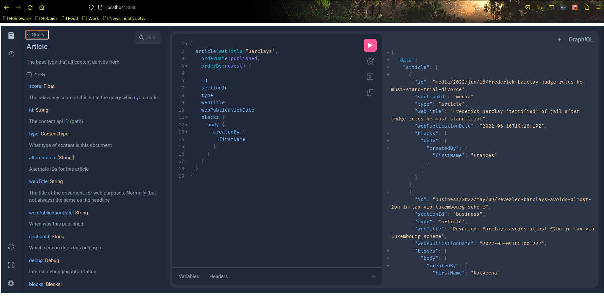

# What is this project?

This is a ten-percent project to explore the possibilities of GraphQL in the Content API.

# How do I run it?

1. Get hold of the `content-api` repository and follow the instructions there to set up a local docker-based Elasticsearch
instance and restore a CAPI snapshot into it.
2. 
```
sbt run
```

(or do the same in your favourite debugger)

3. To view the schema, go to http://localhost:9000/schema/content
4. To make a GraphQL request, go to http://localhost:9000/query.  You will need to "fake" the Kong authentication
header, set a header called `X-Consumer-Username` to the value `:internal` (note the `:`) in order for the API to work.

## Using curl sucks.  What better options do I have?

I've included a basic build of [GraphiQL](https://www.npmjs.com/package/graphiql) in the `explorer/` subdirectory.

In order to use this, simply:

1. Make sure you have a recent version of node.js installed along with the `yarn` package manager
2. `cd explorer`
3. `yarn && yarn start`
4. Wait for it to build
5. Go to http://localhost:8080 in your browser
6. If it complains about a network error, check you have the backend running with `sbt run` or similar
7. Enjoy

